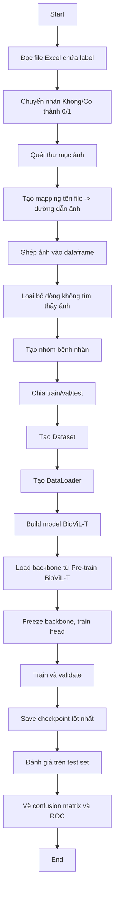

# Flowchart cho finetune_biovilt_ce.py

```mermaid
flowchart TD
    A[Start] --> B[Đọc file Excel chứa label]
    B --> C[Chuyển nhãn Khong/Co thành 0/1]
    C --> D[Quét thư mục ảnh]
    D --> E[Tạo mapping tên file -> đường dẫn ảnh]
    E --> F[Ghép ảnh vào dataframe]
    F --> G[Loại bỏ dòng không tìm thấy ảnh]
    G --> H[Tạo nhóm bệnh nhân]
    H --> I[Chia train/val/test]
    I --> J[Tạo Dataset]
    J --> K[Tạo DataLoader]
    K --> L[Build model BioViL-T]
    L --> M[Load backbone từ Pre-train BioViL-T]
    M --> N[Freeze backbone, train head]
    N --> O[Train và validate]
    O --> P[Save checkpoint tốt nhất]
    P --> Q[Đánh giá trên test set]
    Q --> R[Vẽ confusion matrix và ROC]
    R --> S[End]
```
