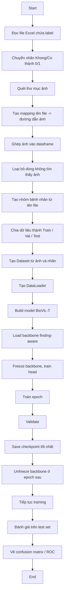

# Flowchart cho finetune_setA_findingaware.py

## Ý nghĩa từng bước

- B: đọc dữ liệu từ Excel
- C: chuyển nhãn sang dạng số để train
- D-E: tìm và nối đường dẫn ảnh vào dataframe
- I: chia dữ liệu theo nhóm bệnh nhân để tránh leakage
- J-K: chuẩn bị dữ liệu cho PyTorch
- L-M: nạp backbone BioViL-T đã học trước
- N-S: train model theo 2 giai đoạn
- T-U: đánh giá hiệu suất bằng metric như ROC AUC, accuracy, sensitivity, specificity
